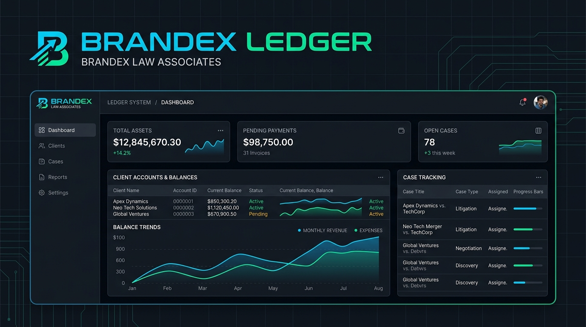

# Brandex Law Associates — Ledger System

A **Neo-Brutalism** styled ledger and client account management system for Brandex Law Associates, built with vanilla HTML/JS and backed by **Supabase** (PostgreSQL).

---

## Features

- **73 Client Accounts** — Full ledger history for all clients (A-001 → A-067)
- **Case Entries** — Track trademark filings with Folder No, Stage (S1–S4), TM No, and amounts due
- **Payment Receipts** — Record payments received against client balances
- **Dashboard** — Aggregated stats (total clients, total received, outstanding balance, total entries)
- **Search & Filter** — Real-time client search across all accounts
- **Ledger View** — Full scrollable ledger per client with running balance
- **Export** — CSV export of clients and all entries
- **Print / Receipt** — Print-optimised ledger receipts per client
- **Activity Log** — Full audit trail of all actions

## Tech Stack

| Layer | Technology |
|-------|-----------|
| Frontend | Vanilla HTML + CSS + JavaScript |
| Database | Supabase (PostgreSQL) |
| Fonts | Bebas Neue, Space Grotesk, DM Mono |
| Design | Neo-Brutalism — Cream #F0E8D0, Maroon #6C1C1F, Gold #B0740E |
| Hosting | Vercel |

## Database Schema

### clients
| Column | Type | Description |
|--------|------|-------------|
| client_code | text (PK) | Unique code e.g. A-001 |
| client_name | text | Client display name |
| header_balance | numeric | Opening ledger balance |
| ank_name | text | Client bank name |
| ank_account | text | Account number |
| ank_iban | text | IBAN |

### ledger_entries
| Column | Type | Description |
|--------|------|-------------|
| client_code | text (FK) | Links to clients |
| entry_date | date | Date of entry |
| older_no | text | Case/Folder number |
| stage | text | S1, S2, S3, S4 |
| 	m_no | text | TM Registration number |
| details | text | Description |
| mount_due | numeric | Amount charged |
| mount_received | numeric | Payment received |
| 
unning_balance | numeric | Balance after entry |
| entry_type | text | Auto: 'case' or 'payment' |

## Setup & Development

1. Clone the repo
2. Copy .env.example to .env and fill in your Supabase keys
3. Run the migration: supabase db push
4. Seed the database: python migrate_to_supabase.py
5. Open index.html in a browser or deploy to Vercel

## Data Source

All ledger data is sourced from 
ew_data_unzipped/ledger_all_clients.json — the canonical JSON export of the original Excel ledger workbook with 73 client sheets.

## License

MIT — See [LICENSE](LICENSE)
