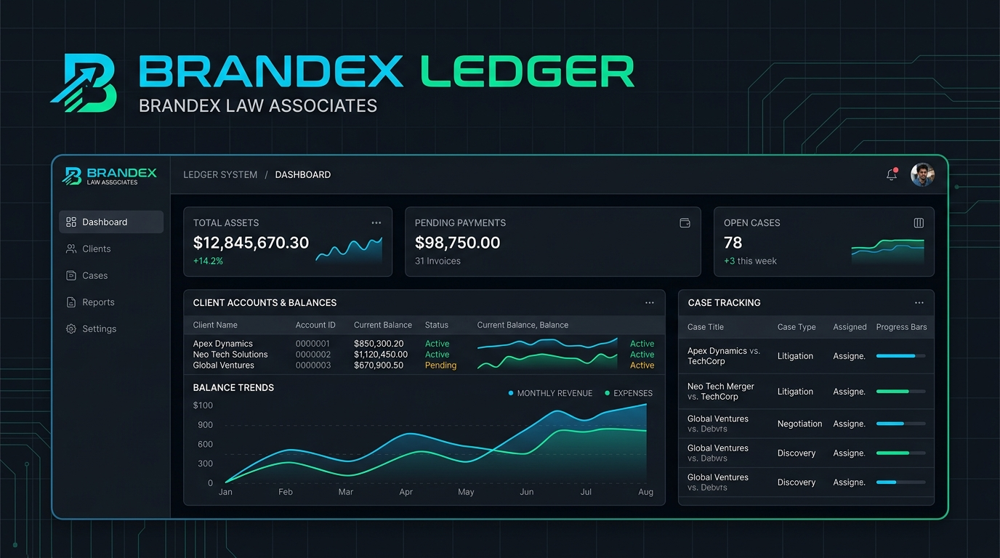

# Brandex Law Associates — Ledger System v2



**TypeScript + React SaaS rewrite** of the original vanilla HTML ledger.

Neo-Brutalism theme preserved (Cream `#F0E8D0`, Maroon `#6C1C1F`, Gold `#B0740E`).

> **Branch:** `feature/typescript-saas`  
> Original single-file app is still on `main` (and kept as `index.html` here for reference).

---

## What's new in v2

- **TypeScript** throughout
- **React 19 + Vite**
- **Supabase Auth** (login / signup)
- **TanStack Query** for data fetching
- **Multi-tenant foundation** (organizations + profiles + roles)
- Same Neo-Brutalism visual language
- Dashboard, Clients list, per-client Ledger view
- Ready for roles (`owner` / `admin` / `member` / `viewer`)

---

## Tech Stack

| Layer        | Technology                          |
|--------------|-------------------------------------|
| Frontend     | React 19 + TypeScript + Vite        |
| Styling      | Tailwind CSS 4 + Neo-Brutalism tokens |
| Data         | Supabase (PostgreSQL) + TanStack Query |
| Auth         | Supabase Auth                       |
| Fonts        | Bebas Neue, Space Grotesk, DM Mono  |
| Hosting      | Vercel (recommended)                |

---

## Quick Start

```bash
git clone https://github.com/0utLawzz/Brandex-Ledger.git
cd Brandex-Ledger
git checkout feature/typescript-saas

npm install
cp .env.example .env
# Fill in VITE_SUPABASE_URL and VITE_SUPABASE_ANON_KEY

npm run dev
```

App runs at http://localhost:5173

### Apply the new SaaS migration

```bash
# If you use Supabase CLI
supabase db push
# or run the SQL in supabase/migrations/20261002000001_saas_auth_and_tenancy.sql
# via the Supabase SQL editor
```

---

## Project Structure

```
src/
├── components/layout/   # DashboardLayout
├── contexts/            # AuthContext
├── lib/                 # supabase client, utils
├── pages/               # Login, Dashboard, Clients, ClientLedger
├── types/               # Database types
├── App.tsx
├── main.tsx
└── index.css            # Theme + Neo-Brutalism utilities
```

---

## Environment

```env
VITE_SUPABASE_URL=https://sygfnemgebuhtqpmedbg.supabase.co
VITE_SUPABASE_ANON_KEY=your_anon_key_here
```

---

## Roadmap (next steps)

- [x] TypeScript + React rewrite
- [x] Login / Sign up
- [x] Dashboard KPIs
- [x] Clients table + search
- [x] Per-client ledger view
- [x] Multi-tenant schema foundation
- [ ] Org-scoped RLS policies (tighten after data migration)
- [ ] Add / edit clients & ledger entries UI
- [ ] CSV export + print receipts
- [ ] Role-based permissions in UI
- [ ] Activity log
- [ ] Proper TanStack Router (file-based routes)

---

## Original v1

The original vanilla HTML/JS version remains on the `main` branch and as `index.html` in this branch for reference / rollback.

---

## License

MIT
